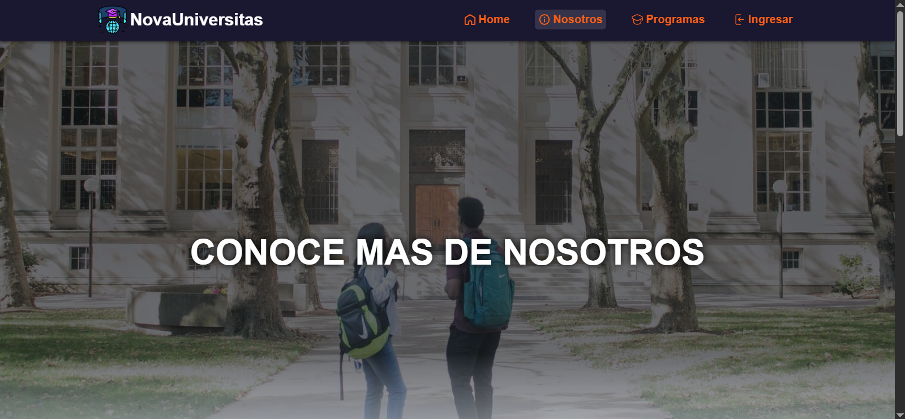
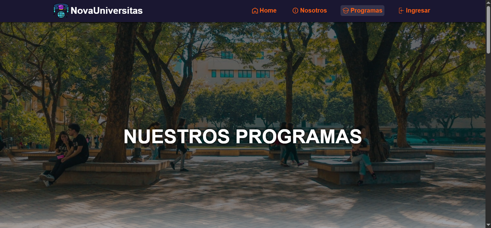
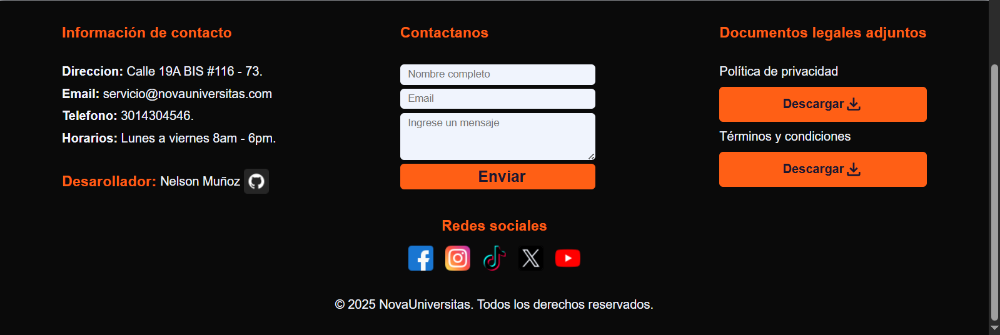

 

 # 🎓 GestionUniversidad-Front

  

Esta es la **interfaz de usuario** para la Gestión Universitaria de **NovaUniversitas**.  
Se trata de una SPA (Single Page Application) basada en **Angular**, diseñada para administrar estudiantes, módulos, programas y otros elementos del sistema.


## 📋 Tabla de Contenido
- [🎓 GestionUniversidad-Front](#-gestionuniversidad-front)
  - [📋 Tabla de Contenido](#-tabla-de-contenido)
  - [🗂️ Estructura del Proyecto](#️-estructura-del-proyecto)
  - [⚡️ Descripción General](#️-descripción-general)
  - [⚙️ Instalación y Ejecutable Local](#️-instalación-y-ejecutable-local)
      - [1️⃣ Clonar este repositorio](#1️⃣-clonar-este-repositorio)
      - [2️⃣ Instalar dependencias](#2️⃣-instalar-dependencias)
      - [3️⃣ Ejecutar el proyecto en modo de desarrollo](#3️⃣-ejecutar-el-proyecto-en-modo-de-desarrollo)
      - [4️⃣ Acceder a la aplicación](#4️⃣-acceder-a-la-aplicación)
  - [🌐 Características principales](#-características-principales)
  - [📁 Scripts principales](#-scripts-principales)
  - [📄 Variables de Entorno](#-variables-de-entorno)
  - [🎨 Capturas de Pantalla](#-capturas-de-pantalla)
  - [👥 Contribución](#-contribución)
  - [✉️ Contacto](#️-contacto)

## 🗂️ Estructura del Proyecto

```plaintext
📁 GestionUniversidad-Front/
├─ 📁 public/
│  ├─ 📁 documentos/
│  ├─ 📁 icons/
│  ├─ 📁 img/
│  └─ 📁 programas/
├─ 📁 src/
│  └─ 📁 app/
│     ├─ 📁 components/
│     │  └─ (footer, nav, overlay, tabla-estudiantes, form-*)
│     ├─ 📁 interfaces/
│     │  └─ (Estudiante.ts, EstudianteLogin.ts, EstudianteRegistrar.ts, OpcionesOverlay.ts)
│     └─ 📁 models/
│        └─ modelos.ts
│  └─ 📁 pages/
│     └─ (home, login, estudiantes, modulos, nosotros, programas)
│  └─ 📁 services/
│     └─ (auth, estudiantes, programas, usuario, comunicacion)
│  └─ 📁 util/
│     └─ (encrypt.ts, utilidad.ts)
├─ 📁 environments/
│  └─ environment.ts
│  └─ environment.development.ts
```

## ⚡️ Descripción General

✅ Framework: **Angular 16+**  
✅ Lenguaje: **TypeScript**  
✅ Diseño basado en **Componentes** para escalabilidad y modularidad.  
✅ Consumo de APIs REST para obtener y enviar datos al backend.  
✅ Autenticación y autorización mediante JWT para acceso seguro.  
✅ Utilidades de encriptación y manejo de datos de sesión para garantizar la seguridad.


## ⚙️ Instalación y Ejecutable Local

#### 1️⃣ Clonar este repositorio
```bash
git clone https://github.com/Ginto11/GestionUniversidad-Front.git
```

#### 2️⃣ Instalar dependencias
```bash
npm install
```

#### 3️⃣ Ejecutar el proyecto en modo de desarrollo
```bash
ng serve
```

#### 4️⃣ Acceder a la aplicación
```bash
http://localhost:4200/
```

## 🌐 Características principales
- 👥 CRUD de estudiantes: Listado, creación, edición y eliminación.

- 🗂️ Visualización de módulos y programas para estudiantes y visitantes.

- 🔐 Inicio de sesión y autorización de usuarios.

- ✅ Alertas overlay para comunicar éxito o error en acciones.

- 📄 Visualización de documentación pública (términos y política de privacidad).

- 💳 Consumo de servicios REST para obtener datos del backend.

- 🎨 Stack Tecnológico
- ⚡️ Framework: Angular 19

- 🐍 Lenguaje: TypeScript

- 🌐 Librerías principales: **Angular Router**, **Angular Forms** y **Angular HTTP Client**.

- 🎨 UI/UX: HTML5, CSS3

- 🔐 Autenticación: Token JWT + servicios de utilidades para encriptación

## 📁 Scripts principales

| Comando    | Descripción                         |
| ---------- | ----------------------------------- |
| `ng serve` | Ejecuta la app en modo desarrollo   |
| `ng build` | Compila para producción             |
| `ng test`  | Ejecuta pruebas unitarias           |
| `ng lint`  | Verifica y corrige estilo de código |

## 📄 Variables de Entorno
Edita estos archivos para configurar tus versiones, ya sea de producción o desarrollo.

- `src/environments/environment.ts`

- `src/environments/environment.development.ts`

```ts
export const environment = {
  ENCRIPTACION_KEY: 'AROCRSAXLJD',
  URL: 'http://tuservidor/api' // Cambia a tu backend
};
```

## 🎨 Capturas de Pantalla
- Home


- Nosotros


- Programas


- Iniciar sesión y registro.


- Pie de Página.


## 👥 Contribución
Si deseas contribuir:


1. Realiza un fork del proyecto.
2. Crea una nueva rama para tu feature:

```bash
git checkout -b feature/nueva-funcionalidad
```
3. Agrega todos los cambios.
```bash
git  add .
```
4. Haz commit de los cambios:
```bash
git commit -m "Agrega nueva funcionalidad"
```
5. Push al repositorio:
```bash
git push origin feature/nueva-funcionalidad
```

## ✉️ Contacto

Si deseas comunicarte para colaborar, obtener soporte o hacer consultas, contáctanos:

- 📧 **Email**: salinitosnelson@gmail.com


